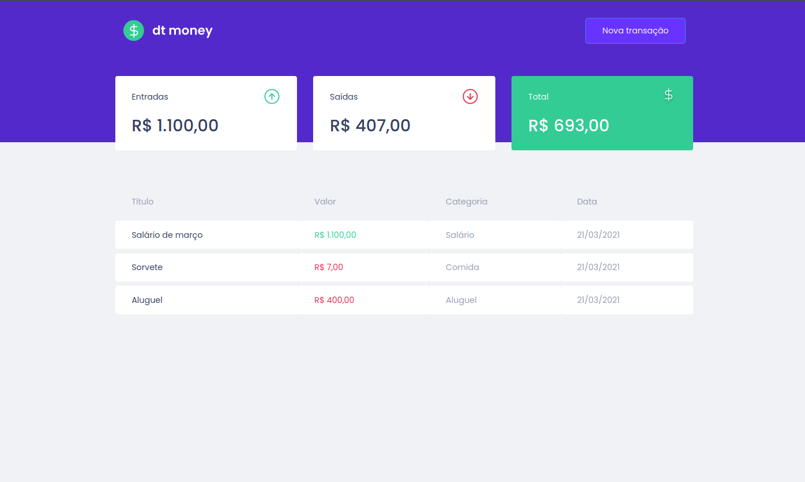

<h1 align="center">
    
    <br>
    dtmoney
</h1>

<p align="center">
  <a href="https://www.linkedin.com/in/roger-fernandes-1488841b9/">
    
  </a>

  <a href="./LICENSE"> 
    
  </a>
</p>

<h4 align="center">
  This is the second project on the ReactJS track from the <a href="https://github.com/Rocketseat/">Rocketseat </a> Ignite bootcamp.
</h4>


<p align="center">
  <a href="#ledger-about">About</a>&nbsp;&nbsp;&nbsp;|&nbsp;&nbsp;&nbsp;
  <a href="#running-starting">Starting</a>&nbsp;&nbsp;&nbsp;|&nbsp;&nbsp;&nbsp;
  <a href="#computer-technologies">Technologies</a>&nbsp;&nbsp;&nbsp;|&nbsp;&nbsp;&nbsp;
  <a href="#memo-license">License</a>
</p>



<p align="center">
  <a href="" target="_blank">
    
  </a>
</p>

## :ledger: About
This is a personal finance tracking app. With the following features:

- Add deposit transitions;
- Add withdrawal transitions;
- Calculate deposits;
- Calculate withdrawals;
- Calculate the total;


## :running: Starting

Before starting :checkered_flag:, you need to have installed:
- [Git](https://git-scm.com) 
- [Node](https://nodejs.org/en/)
- [Yarn](https://classic.yarnpkg.com/en/)

```bash
# Clone this project
$ git clone https://github.com/rogeraf15/ignite_dtmoney.git

# Access
$ cd ignite_dtmoney

# Install dependencies
$ yarn

# Run the project
$ yarn start

# The server will initialize in the <http://localhost:3000>
```

## :computer: Technologies

- [ReactJS](https://reactjs.org/)
- [Typescript](https://www.typescriptlang.org/)
- [Axios](https://github.com/axios/axios)
- [Polished](https://github.com/styled-components/polished)
- [MirageJS](https://miragejs.com/)
- [React Modal](https://github.com/reactjs/react-modal)
- [Styled Components](https://github.com/styled-components/styled-components)
  


## :memo: License

This project is under the MIT license. See the [LICENSE](./LICENSE) for more information.

---

Made with ♥ by Roger Fernandes :wave: [Get in touch!](https://www.linkedin.com/in/roger-fernandes-1488841b9/)

